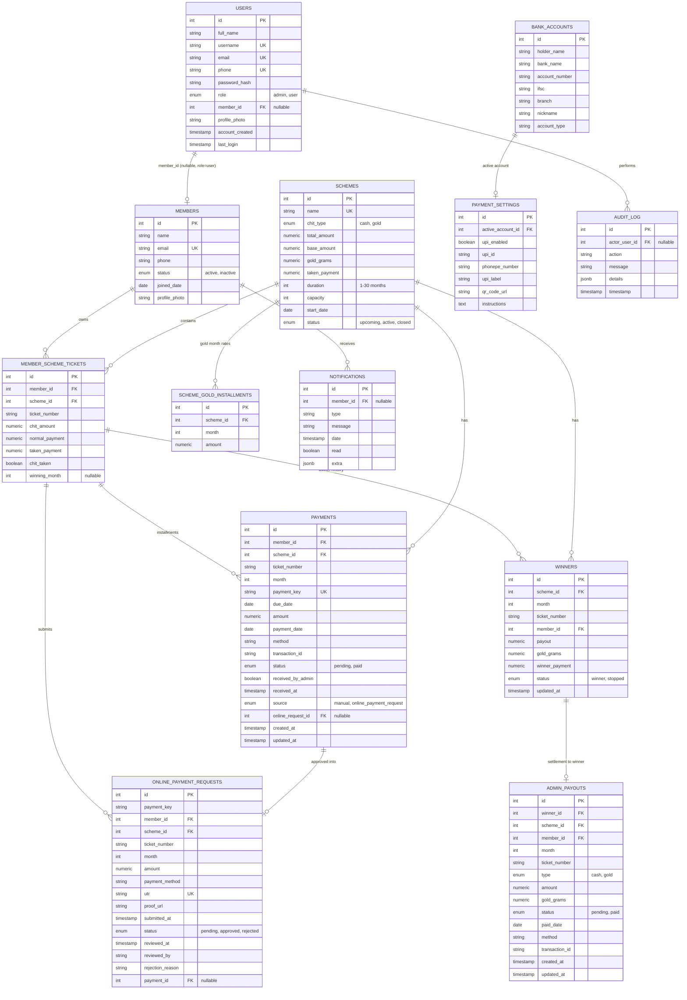

# FinTrack — Backend Database Design (derived from frontend analysis)

Source analyzed: `github.com/vvslsn/fintrack-new`

## 0. What's actually in the repo

- `frontend/` — the real application. Pure HTML/CSS/vanilla JS, ~14,000 lines across
  `script.js` (auth), `schemes.js` / `scheme-details.js` (chit schemes + monthly winners),
  `members.js` (member directory + chit tickets), `payments.js` (installment ledger + admin
  payout ledger), `payment-settings.js` (bank/UPI config), `online-payment-admin.js`
  (UPI/bank-transfer verification), `profile-menu.js`, and a parallel `frontend/user/*` app
  for members. All state currently lives in **`localStorage`**, under the keys defined in
  `fintrack-core.js` (`fintrackAccounts`, `chitfund_schemes`, `chitfund_members`,
  `chitfund_payments`, `chitfund_winners`, `chitfund_admin_payouts`,
  `chitfund_online_payment_requests`, `chitfund_notifications`, `chitfund_audit_log`,
  `fintrack_payment_settings`).
- `backend/` — an **empty stub**: `express` + `mongoose` wired to `connectDB()`, one `GET /`
  health route, no models, no schemas, no routes, no controllers. Confirms your premise: there
  is no real backend/data layer yet — the frontend is the only source of truth.

The app is a **chit-fund (rotating savings/ROSCA) management system**, not a generic budgeting
tool: admins create *chit schemes*, enroll members into numbered *tickets* inside a scheme,
collect a *monthly installment* per ticket, declare a *monthly winner* per ticket (who then
receives a lump-sum payout and pays a higher installment for the rest of the term), and
optionally let members pay online (UPI/bank transfer) with admin verification.

This document normalizes that localStorage data model into a relational schema. A matching
`schema.sql` (PostgreSQL-flavored, portable to MySQL with minor tweaks) is provided alongside
this file.

---

## 1. Entity-Relationship Diagram

---

## 2. Table-by-table notes (mapped to the actual frontend code)

### 2.1 `users` (replaces `localStorage.fintrackAccounts`)
Created in `script.js` signup: `fullName, username, phone, email, passwordHash, accountCreated,
lastLogin, profilePhoto, role`. `role` is either `"admin"` (created via Admin → Create Account)
or `"user"` (created via Members → Create Login, see `members.js: syncMemberLoginAccount`),
in which case the account is permanently linked to one `members.id` via `member_id`. Your
original sketch had a separate `Admin_check(user_id, is_admin)` table — the frontend never
models it that way (it's a single `role` enum on the account), so a second boolean table would
just be a redundant 1:1 shadow of `role`. I kept a single `role` column and noted the
alternative in §4 in case you want role history/multi-role support later.

- `username`, `email`, `phone` are all checked for duplicates on signup → all three `UNIQUE`.
- `password_hash` — the frontend calls a `hashPassword()` helper client-side (not a real
  backend hash); on a real backend this must be bcrypt/argon2 server-side.
- A hard-coded fallback admin (`admin`/`admin`, `script.js` line ~682) exists client-side only;
  don't carry that into the backend — seed a real admin row instead.

### 2.2 `members` (replaces `chitfund_members`, minus the nested `schemes[]`)
`members.js` stores each member as `{id, name, email, phone, schemes: [...], status,
joinedDate, profilePhoto}`. `email` is checked for uniqueness on create. A member can exist
in the directory with **zero** scheme tickets ("directory-only member").

### 2.3 `schemes` (replaces `chitfund_schemes`)
From `schemes.js: newScheme` object. `name` is checked for case-insensitive duplicates.
`chit_type` drives very different business logic (see §3). `gold_grams` and
`gold_monthly_installments` only apply when `chit_type = 'gold'`; `total_amount`/`base_amount`
drive `cash` math. `capacity` is the planned member count (member count itself, `members`, is
a derived/cached count in the frontend — don't store it as a column, compute it with
`COUNT(member_scheme_tickets)`).

### 2.4 `scheme_gold_installments` (normalizes `scheme.goldMonthlyInstallments`)
The frontend stores this as an object keyed by month string, e.g. `{"1": 5000, "2": 5200}`.
Normalized to one row per `(scheme_id, month)`. Only populated for gold chits.

### 2.5 `member_scheme_tickets` (normalizes `member.schemes[]`)
This is the real join table between a member and a scheme — one row per **ticket**, not per
member. `members.js: memberScheme` object: `{id, schemeId, name, ticket, chitAmount,
normalPayment, takenPayment, chitTaken, winningMonth}`. Business rules enforced in the
frontend that the DB should also enforce:
- **A ticket number is unique within a scheme** (`duplicateTicket` check in `members.js`) →
  `UNIQUE (scheme_id, ticket_number)`.
- **The same member can hold multiple tickets in the same scheme** (explicitly commented in
  the code: "the same person can own multiple chits in the same scheme") → do **not** put a
  unique constraint on `(member_id, scheme_id)` alone.
- `chit_amount`, `normal_payment`, `taken_payment` are **snapshots** captured from the scheme
  at ticket-creation time (not live FK lookups) — replicate that: write them once, don't
  recompute on every read, mirroring the frontend's caching behavior.
- `winning_month` + `chit_taken` get set when a `winners` row is created for that ticket, and
  cleared when the winner record is removed (`scheme-details.js`).

### 2.6 `payments` (replaces `chitfund_payments`) — the **installment ledger**
From `payments.js: paymentRecord`. One row per member+scheme+ticket+month. `payment_key` is
the frontend's business key `memberId|schemeId|ticket|month` — a computed idempotency key; keep
it as a **generated/unique column** to block duplicate installment entries, which is exactly
what the frontend's `duplicatePayment` check does today.
- `status`: `'pending'` until `payment_date` is set, then `'paid'`.
- `source`: `'manual'` (admin typed it in) vs `'online_payment_request'` (came from member
  self-service payment, see 2.9); `online_request_id` links back only in the second case.
- Amount logic (must be enforced in application/service layer, not just stored):
  **cash chit** → normal installment = `round(total_amount * 0.05)`; once a ticket wins, its
  installment becomes `round(total_amount * 0.06)` from the winning month onward
  (`fintrack-core.js: paymentAmount`, `refreshPendingPaymentAmountsForWinner` — this rewrites
  *all future unpaid* installments' amount when a winner is declared; **paid** installments are
  historical and are never rewritten). **Gold chit** → installment = the scheme's configured
  `scheme_gold_installments` amount for that month.

### 2.7 `winners` (replaces `chitfund_winners`) — the "Monthly Winners" concept you sketched
From `scheme-details.js: record`. One row per ticket that has won (a ticket, once it wins, can
never win again in that scheme — enforced by `duplicateTicketThisScheme`). Multiple *different*
tickets can win in the *same* month — no limit (explicit in the code/UI copy) — so do **not**
put a unique constraint on `(scheme_id, month)` alone; instead
`UNIQUE (scheme_id, ticket_number)` where `status = 'winner'`.
- `status = 'stopped'` is a special "this month was voided, re-enter" placeholder the admin can
  create (`stopWinnerMonth()`); it has no member/payout attached — that's why `member_id`,
  `payout`, etc. must be **nullable**.
- `payout` = cash winning amount (cash chits) or 0 (gold — grams live in `gold_grams` instead).
- `winner_payment` = the new (6%) installment amount charged to this ticket for the winning
  month onward — cash view of `payment_amount` after winning.
- Your sketch's "Available member" field is a **UI-only derived count** (how many tickets are
  still eligible to win) — never persisted by the frontend, so it's intentionally left out of
  the schema; compute it as `capacity - COUNT(winners WHERE status='winner')`.

### 2.8 `admin_payouts` — money/gold the **admin pays out to** the winner
This is a **separate ledger from `payments`** by explicit design comment in `payments.js`
("Member installments and admin-to-member winner payouts are intentionally stored
separately"). One row is auto-generated per `winners` row (`syncAdminPayoutRecords`), tracking
whether the admin has actually handed over the lump sum/gold yet (`status: pending → paid`).
`amount`/`gold_grams` are computed from the scheme's payout curve
(`round(total*(0.95+(month-1)*0.01))` for cash, or the ticket's gold grams).

### 2.9 `online_payment_requests` (replaces `chitfund_online_payment_requests`)
Member-submitted self-service payments (`user/user-pages.js: renderPayNowPage`), reviewed by
an admin (`online-payment-admin.js`). `utr` (UPI transaction reference) is checked for
duplicates against both other requests and already-paid `payments.transaction_id` — enforce
uniqueness at the application layer across both tables (a raw DB `UNIQUE` on `utr` alone would
be safe for this table but won't catch cross-table collisions; add a service-layer check or a
trigger). On `approve`, the code either reuses an existing `payments` row (same
`payment_key`) or inserts a brand-new one with `source='online_payment_request'` and links back
via `payment_id`. `proof` is currently a base64 data-URI embedded directly in localStorage —
in a real backend this must become a `proof_url` pointing at object storage (S3/Cloud
Storage), not a DB blob.

### 2.10 `bank_accounts` + `payment_settings` (replaces `fintrack_payment_settings`)
Global admin-configured payout instruments — not per-scheme, not per-member. One row per bank
account (multiple allowed, one flagged "active" via `payment_settings.active_account_id`), plus
a single-row UPI/QR/instructions config. `account_number` is validated client-side as 8–20
digits and `ifsc` as the standard Indian bank format — replicate those as `CHECK` constraints
or app-layer validation.

### 2.11 `notifications` (replaces `chitfund_notifications`)
Simple per-member inbox: `{id, memberId, type, message, date, read, ...extra}` where `extra`
is a free-form bag of ids (`requestId`, `paymentId`, etc.) — kept as `JSONB` since its shape
varies by notification type rather than forcing a wide sparse table.

### 2.12 `audit_log` (replaces `chitfund_audit_log`)
Every mutating action in the app calls `window.fintrackAudit(action, message, details)` (scheme
created/updated/deleted, payment created/updated, winner added/removed, online payment
approved/rejected, payment settings updated, etc.). `details` is arbitrary per-action metadata
→ `JSONB`. Add `actor_user_id` (not present in the current frontend calls, but essential for a
real audit trail — right now the frontend has no reliable "who did this" on audit rows, which
is a gap worth closing in the backend).

---

## 3. Business rules the frontend enforces that must move into the backend

These currently live in scattered client-side `if` checks; a real backend must re-implement
them as constraints/validators/service logic, since a browser-only check is trivially bypassed
by calling the API directly:

1. Duplicate scheme name (case-insensitive) → reject.
2. Duplicate member email → reject.
3. Phone number must be exactly 10 digits (member + signup forms).
4. Ticket number unique **within a scheme** (across all members) — not globally unique.
5. A ticket that has already won in a scheme can never win again in that scheme.
6. Multiple different tickets may win in the same month; no cap.
7. `duration` accepted range 1–30 months (per your original sketch) — the scheme-details winner
   picker prompts `1-${duration}` and validates against it.
8. Payment idempotency key `(member_id, scheme_id, ticket_number, month)` must be unique —
   block duplicate installment rows.
9. Cash-chit installment = 5% of `total_amount`, rising to 6% from the ticket's winning month
   onward; **only unpaid** installments are ever rewritten when a winner is declared — paid
   history is immutable.
10. Gold-chit installment = the scheme's configured per-month rupee amount
    (`scheme_gold_installments`), independent of any winner logic.
11. Online-payment `utr` must be unique and not already recorded as a paid transaction.
12. An `online_payment_requests` row can only be approved/rejected once (`status` starts
    `'pending'`, transitions once to `'approved'` or `'rejected'`).
13. An admin account (`role='admin'`) is never converted into a member-linked account by the
    member-sync routine — role changes downgrade one direction only in the current app logic;
    worth a real state machine in the backend.

---

## 4. Deliberate deviations from your original field sketch

- **`Admin_check` table dropped, `role` enum kept on `users`** — the frontend never models a
  separate boolean-per-user table; it's a single mutually-exclusive role. Straightforward to
  reintroduce as `admin_check(user_id, is_admin)` later if you want role history or multiple
  roles per user, but there's no frontend evidence it's needed today.
- **`Scheme.members` count dropped** — the frontend treats it as a cached/derived number
  (`syncSchemeMemberCounts()`); model it as a query (`COUNT(*) FROM member_scheme_tickets
  WHERE scheme_id = ...`), not a stored column, to avoid drift.
- **"Add member" split into `members` + `member_scheme_tickets`** — your sketch conflated
  "member" and "member's ticket in a scheme" into one node; the frontend itself splits these
  (a member can exist with zero tickets, and can hold several tickets in one scheme), so the
  relational model needs the join table to stay correct.
- **"Monthly Winners.Available member" dropped as a stored field** — it's a computed
  eligibility count in the UI, never persisted.
- **Chit `type` renamed `chit_type`** and constrained to the two values the frontend actually
  normalizes to (`cash`, `gold`) via `normalizeChitType()`, even though the create-scheme
  dropdown only ever offers those two labels today.

---

## 5. Suggested indexes (beyond PKs/FKs/UNIQUEs already listed above)

- `payments (scheme_id, month)`, `payments (member_id)`, `payments (status)`
- `member_scheme_tickets (scheme_id)`, `member_scheme_tickets (member_id)`
- `winners (scheme_id, status)`
- `online_payment_requests (status)`, `online_payment_requests (member_id)`
- `notifications (member_id, read)`
- `audit_log (timestamp)`, `audit_log (action)`

See `schema.sql` for the full runnable DDL (PostgreSQL syntax — swap `SERIAL`→`AUTO_INCREMENT`,
`JSONB`→`JSON`, and `TIMESTAMPTZ`→`DATETIME` for MySQL).
